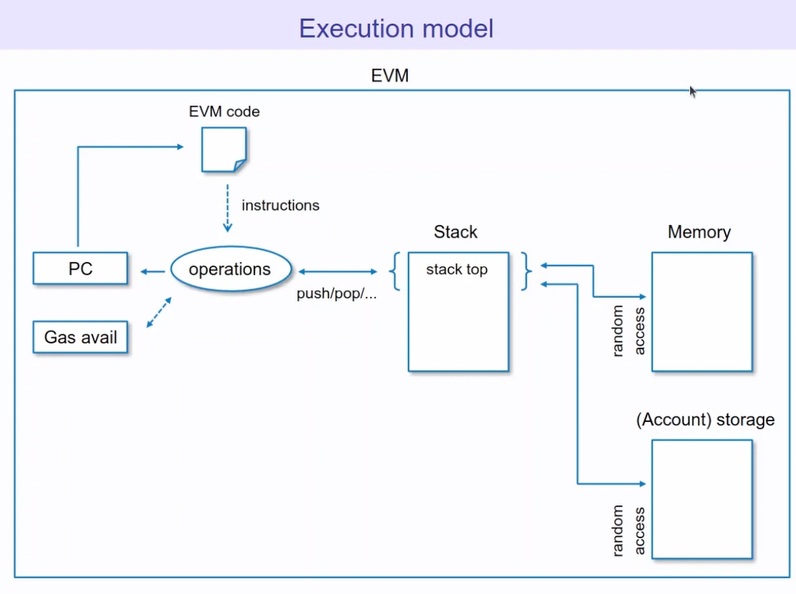

# EVM 与 YUL 课程

## EVM设计

视频 AI 总结： 该视频是关于以太坊虚拟机（EVM）的迷你系列的第一集，旨在帮助开发者、安全研究员和 DevOps 工程师理解 EVM 的底层原理。视频从高层次概括了 EVM 的概念，将其描述为一个分布式状态机，通过交易改变世界状态。视频还介绍了 EVM 的关键组件，包括账户、交易、区块、内存、堆栈和存储，以及 gas 的作用和 EVM 的执行模型。

关键信息：

- EVM 是一个分布式状态机，通过交易改变世界状态。
- 世界状态是地址到账户状态的映射。
- 账户分为外部拥有账户（EOA）和合约账户。
- 交易由 EOA 发起，可以是合约创建或消息调用。
- 区块包含多个交易，由验证者决定交易顺序。
- EVM 有只读内存、持久化存储和易失性状态。
- Gas 用于衡量计算复杂度，防止拒绝服务攻击。
- EVM 代码由字节码组成，通过操作码执行。
- 事件（logs）用于链下监听状态变化，无法在合约内读取。

​      Hello there and welcome to my channel. I'm Delirious, I'm independent security researcher performing solo audits, team audits and bug hunting. Today I present to you mini-series on EVM, which is foundational topic for any web-free tech guy, be it smart contracts developer,security researcher or DevOps engineer. I share with you everything you need to know to read, review and write EVM native code. However, I won't spend much time describing topics like peer-to-peer consensus nodes and other topics not directly related to virtual machine executing the code. Additionally, there's a prerequisite, it is not an introductory course. I assume that you can write code in Solidity and have general knowledge on how blockchain works. If you don't, please check out Patrick Conley's full course on Solidity and read foundational topics description from official Ethereum docs. All additional materials are put down in the video description. Okay, it's time to dive in. 

​     大家好，欢迎来到我的频道。我是Delirious，我是一名独立的安全研究员，进行单独审计、团队审计和漏洞挖掘。今天我向大家介绍关于EVM的迷你系列，EVM是任何Web3技术人员的基础主题，无论是智能合约开发者，安全研究员还是DevOps工程师。我将与你分享阅读、审查和编写EVM原生代码所需的一切知识。但是，我不会花太多时间描述像点对点共识节点以及其他与执行代码的虚拟机没有直接关系的主题。此外，还有一个前提条件，这不是一个入门课程。我假设你可以用Solidity编写代码，并且对区块链的工作原理有一般的了解。如果你不了解，请查看Patrick Conley关于Solidity的完整课程并阅读以太坊官方文档中关于基础主题的描述。所有其他材料都放在视频描述中。好了，是时候深入了解了。

In this module, I described EVM from the high level. This will make going through the specifics easier to understand.In this episode, I'll use Ethereum EVM illustrated by Pakenobu which gives valuable insights into EVM. But first of all, let's talk about what Ethereum virtual machine is. Generally, it can be thought of as a distributed state machine, defining a state transition function. As you can see in this slide, we have some initial world state and we define state transition function, which in case of EVM is transaction. And after applying that, we are ending up with a new word state.Well, actually, transactions are not executed as a single entity, but are packed into blocks and then executed as a whole block.Selecting transactions that go into block are not restricted by EVM, and the validator preparing the blocks have full discretion over what goes inside of it. This allows them to extract additional value by putting the transactions in specific order or picking the most profitable ones or even creating and placing their own transactions in the middle to manipulate the outcome of the transactions. You should always keep that in mind and make sure that the contracts that you work on have proper protection against that. 

在本模块中，我从高层次描述EVM。这将使理解具体细节更容易。在本集中，我将使用Pakenobu绘制的以太坊EVM图示，它提供了对EVM的宝贵见解。但首先，让我们谈谈以太坊虚拟机是什么。一般来说，它可以被认为是一个分布式状态机，定义了一个状态转换函数。正如你在这张幻灯片中看到的，我们有一些初始的world状态，我们定义了状态转换函数，在EVM的情况下，就是交易。应用之后，我们最终得到一个新的word状态。实际上，交易不是作为单个实体执行的，而是打包成区块，然后作为一个整体区块执行。选择进入区块的交易不受EVM的限制，并且准备区块的验证者对区块内的内容有完全的决定权。这允许他们通过将交易放入特定顺序或选择最有利可图的交易，甚至创建并将他们自己的交易放在中间来操纵交易的结果，从而提取额外的价值。你应该始终牢记这一点，并确保你所使用的合约有适当的保护措施来防止这种情况。


Next, let's discuss how blocks are modifying the word state.  As you can see in this slide, each block provides update to the word state and each new block builds upon previous word state. From the point of view of implementation, you can think about EVM  as a chain of blocks. That's why the name blockchain. 
接下来，让我们讨论区块是如何修改word状态的。正如你在这张幻灯片中看到的，每个区块都提供了对world状态的更新，并且每个新区块都建立在之前的word状态之上。从实现的角度来看，你可以把EVM看作是一个区块的链条。这就是为什么叫区块链。


So what exactly is world state? In simplest words, the world state is a mapping between address and account state. An account is a key object in the world state. It uniformly identifies single entity living within the virtual machine.Its identifier is an account address. 


In EVM, it's a 20 bytes long stream of bytes.Each account also consists of an account state.Account state consists of its address, which is its key, and its state. The state of each address consists of nonce, which is number only used once.In this case, it's current number of transactions that is being executed.


This is to prevent signature replay attacks because it makes sure that each single transaction has a unique identifier, which is used once and then increased. Apart from that, address also has its balance. In case of Ethereum, it's Ether. In case of other EVM implementations, it may differ.Apart from that, each account has storage hash, which is just an index to account storage, and its code hash, which also is an index, but to EVM code. And there are two types of accounts in EVM.One is externally owned account, which is owned by external actor.That means any user of the blockchain can be me, you, whoever. And the most important part here is that it has private key from which public key is being deduced and from the hash of public key, an address is created. So externally owned account is just an entity that has private key and signs transaction with this private key. The second type of account is smart contract account, which contains code and storage. It by itself cannot initiate transactions. However, it can receive transactions and call other addresses. So in case of externally owned account, storage hash is hash of zero and code hash is also code hash of zero because externally owned accounts do not possess any storage nor the EVM code.In case of contracts account, storage hash is a pointer to the hash storage of smart contract and code hash is a hash of the bytecode that the smart contract consists of. 

那么，worldstate到底是什么？最简单的说，worldstate是地址和账户状态之间的映射。账户是worldstate中的一个关键对象。它统一地标识了存在于虚拟机中的单个实体。它的标识符是一个账户地址。在EVM中，它是一个20字节长的字节流。每个账户也由一个账户状态组成。账户状态由其地址（即其密钥）及其状态组成。每个地址的状态由nonce组成，nonce是一个只使用一次的数字。在这种情况下，它是当前正在执行的交易的数量。这是为了防止签名重放攻击，因为它确保每个单独的交易都有一个唯一的标识符，该标识符只使用一次，然后递增。除此之外，地址也有它的余额。在以太坊的情况下，它是以太币。在其他EVM实现中，它可能会有所不同。除此之外，每个账户都有storagehash，它只是一个指向账户存储的索引，以及它的codehash，它也是一个索引，但指向EVM代码。EVM中有两种类型的账户。一种是外部拥有账户（ExternallyOwnedAccount,EOA），它由外部参与者拥有。这意味着区块链的任何用户都可以是我、你、任何人。这里最重要的是它有私钥从中推导出公钥，并从公钥的哈希值中创建一个地址。所以外部拥有账户只是一个拥有私钥的实体并使用此私钥签署交易。第二种类型的账户是智能合约账户，它包含代码和存储。它本身不能发起交易。但是，它可以接收交易并调用其他地址。因此，在外部拥有账户的情况下，storagehash是零的哈希值，codehash也是零的codehash，因为外部拥有账户不拥有任何存储或EVM代码。在合约账户的情况下，storagehash是指向智能合约的哈希存储的指针，codehash是智能合约组成的字节码的哈希值。


So how do we determine which address an account have? In case of externally owned accounts, everything starts with private key. So the user generates private key for them and from this private key, the public key is being deduced. Next, the public key is being hashed and the rightmost 160 bits are taken. Those are then treated as an address account. In case of contract accounts, we have two ways of creating an address. If a smart contract is created by create opcode, its address is taken from hash of sender address and the sender nonce and actually the rightmost 20 bytes from this hash are taken. 

那么，我们如何确定一个账户拥有哪个地址呢？在外部拥有账户的情况下，一切都从私钥开始。因此，用户为他们生成私钥，并从这个私钥中推导出公钥。接下来，公钥被哈希，并取最右边的160位。然后将这些位视为地址账户。在合约账户的情况下，我们有两种创建地址的方法。如果智能合约是通过create操作码创建的，那么它的地址是从发送者地址和发送者nonce的哈希值中获取的，实际上从这个哈希值中获取最右边的20个字节。

```solidity
initialisation_code = memory[offset:offset+size]
address = keccak256(0xff + sender_address + salt + keccak256(initialisation_code))[12:]
```


In case of create2, the address is taken from the constant ff added with sender address, the sender provided salt and ketchup of initialization code and similarly to create, it is hashed and rightmost 20 bytes are taken as an address of the contract. And now that we know a bit about accounts, let's move to the transaction. 


So transaction is a single cryptographically signed instruction.And as you saw here, like only the externally owned account has private key to sign anything, that means that the transaction can be only created by externally owned account. 

在create2的情况下，地址是从常量ff中获取的加上发送者地址、发送者提供的salt和初始化代码的keccak哈希值，与create类似，它被哈希，最右边的20个字节被作为合约的地址。现在我们对账户有了一些了解，让我们转向交易。因此，交易是一个单独的密码学签名的指令。正如你在这里看到的，只有外部拥有账户拥有私钥来签署任何东西，这意味着交易只能由外部拥有账户创建。


In EVM, there are two kinds of transaction. One is contract creation. A second is a message call.The difference between them technically is in order to create a smart contract, you have to send transaction to the zero address and have  nonzero length data array. Otherwise, the transaction is treated as a message call. And in a message call, you can either call other externally owned account or contract account. Actually, on the broader level, EVM doesn't really care what you are calling. You can also call account that doesn't exist and it will be okay. Now let's look how contract creation looks more in detail. We have work state before contract creation that we have some specific addresses and their state. And then we are sending transaction again to address zero and nonzero data array, which signifies that this is the init code of the smart contract that you will use. And then EVM executes this init code and puts whatever it returns on the blockchain. And this is stored inside code. Additionally, if anything is set in storage, it is also added here. New address is being created and now you have new smart contract. In case of message call, let's say that you are sending transaction to the address N and it has its account state with input data. This can be either externally owned account or contract account. And after this transaction, its state is being updated. As you can see here, code is not changing here, only storage. That's because EVM doesn't allow you to change the code under specific address. Of course, there are ways to work around that, but we will not talk about it here. If you are interested, you can check out how smart contract proxies work. But what the transaction really consists of? We already spoke about it having a transaction recipient, optional data, but what else is there? So each transaction has nonce, as I described before, to prevent transaction replay attacks. It also has two very important parts, which are gas price and gas limit. 


在EVM中，有两种类型的交易。一种是合约创建。 第二种是消息调用。它们之间的区别在于，从技术上讲，为了创建一个智能合约，你必须将交易发送到零地址，并且拥有非零长度的数据数组。否则，该交易将被视为消息调用。在消息调用中，你可以调用其他外部拥有账户或合约账户。实际上，在更广泛的层面上，EVM并不真正关心你调用的是什么。你也可以调用不存在的账户，这也没关系。现在让我们更详细地看看合约创建是如何进行的。在合约创建之前，我们有一些特定的word状态地址和它们的状态。然后我们再次将交易发送到地址零和非零你将使用的智能合约的初始化代码。数据数组，这表明这是然后EVM执行这个初始化代码，并将它返回的任何内容放在区块链上。这被存储在代码中。此外，如果在存储中设置了任何内容，它也会被添加到这里。正在创建一个新地址，现在你有了新的智能合约。在消息调用的情况下，假设你正在发送交易到地址N，它有它的账户状态和输入数据。这可以是外部拥有账户或合约账户。在这个交易之后，它的状态将被更新。正如你在这里看到的，代码没有改变，只有存储改变了。这是因为EVM不允许你更改特定地址下的代码。 当然，有一些方法可以解决这个问题，但是我们不会在这里讨论它。如果你有兴趣，你可以了解一下智能合约代理是如何工作的。但是交易真正包含什么呢？我们已经说过它有一个交易接收者，可选数据，但是还有什么呢？因此，每个交易都有nonce，正如我之前描述的，以防止交易重放攻击。它还有两个非常重要的部分，即gas price和gas limit。

We will talk about gas a bit later, but in a nutshell, you are saying how much calculation expressed in gas you are willing to do and how much you are willing to pay for it. Next one, we have recipient, which is either address or zero.If this is contract creation, we have value, which is the native coin value. In case of Ethereum, for example, it's Ether. So if this was Ethereum, then the value would mean how much Ether you want to send with your transaction. Next, we have VRNS, which are transaction signature. This actually allows to prove that you are the person that wants to execute this transaction, because you are the only one that has private key. And if you are signing something, that means that you want to perform such action. And finally, we have data. In this slide, it shows us init or data, but actually this is just one field, data. But in case of contract creation, this field serves as a smart contract init code. And now on to the messages. Message is passed between two accounts, and it consists of data, which is just a set of bytes and value. And messages can be either triggered by transaction, which is what we spoke about before, or it can be triggered by EVM code. So smart contract accounts can also call other smart contracts or externally owned accounts. And this is all fine, but how do transactions land in this globally shared database?


 


It is a bit tricky, because at first it can be a bit unintuitive, because there is no single party that runs Ethereum virtual machine. Actually, you have multiple parties running the EVM, and they all reach the consensus of what the world state is. That means that you can think about blockchain as a globally shared decentralized transactional database. So as you can see in this slide, when external actor is sending some transaction, they are using the interface to call the machine that is running the Ethereum node, which has current world state. And then each of the nodes communicates with one another to propagate the current state. Having shared state between nodes is great, but it poses some issues. And the biggest one of them is how do you guarantee atomicity and order? And EVM solves that by having atomic operations. That means that the transaction either fully executes and everything is committed, or there is some error during the transaction execution, and it's reverted to the previous state. EVM solves problem of ordering of transactions simplest way possible, and that is that every transaction has to be executed sequentially. There is no possibility of executing two transactions at the same time. But what about the order of transactions? If we have, for example, two external actors, and actor B first submits two transactions, and then actor A submits three transactions, how do we guarantee that the order of the transaction will be preserved? 

我们稍后会讨论gas，但简而言之，你是在说你愿意进行多少以gas表示的计算以及你愿意为此支付多少费用。 接下来是 recipient（接收者），它可以是一个地址或者零地址。如果是合约创建，我们有 value（值），它是原生代币的价值。例如，在以太坊的例子中，它是 Ether。所以如果这是以太坊，那么 value 就意味着有多少Ether 你想随你的交易一起发送。接下来，我们有 VRNS，也就是交易签名。这实际上可以证明你是想要执行此交易的人，因为只有你拥有私钥。如果你签名了某些东西，那就意味着你想要执行这样的操作。最后，我们有 data（数据）。在这个幻灯片中，它向我们展示了 init 或 data，但实际上这只是一个字段，data。但在合约创建的情况下，这个字段用作智能合约的初始化代码。现在我们来看消息。消息在两个账户之间传递，它由 data 组成，它只是一组字节和 value。消息可以由交易触发，也就是我们之前所说的，或者它可以由 EVM 代码触发。因此，智能合约账户也可以调用其他智能合约或外部拥有的账户。这一切都很好，但是交易如何进入这个全局共享的数据库？这有点棘手，因为起初它可能有点不直观，因为没有单一的一方运行以太坊虚拟机。实际上，你有多个方在运行 EVM，他们都达成关于世界状态是什么的共识。这意味着你可以把区块链看作是一个全球共享的去中心化的交易数据库。所以正如你在这个幻灯片中看到的，当外部参与者发送一些交易时，他们正在使用接口来调用机器该机器正在运行以太坊节点，该节点具有当前的世界状态。然后每个节点彼此通信以传播当前状态。在节点之间共享状态很好，但它带来了一些问题。其中最大的问题是如何保证原子性和顺序？EVM 通过具有原子操作来解决这个问题。这意味着交易要么完全执行并且一切都提交，或者在交易执行期间出现一些错误，并且它恢复到之前的状态。EVM 以最简单的方式解决了交易排序的问题，那就是每个交易都必须按顺序执行。不可能同时执行两个交易。但是交易的顺序呢？例如，如果我们有两个外部参与者，参与者 B 首先 提交两个交易，然后参与者 A 提交三个交易，我们如何保证交易的顺序会被保留？

actually, we cannot. What EVM does, it keeps the transaction pool, which it calls mempool, and all the transactions that are submitted to the Ethereum node first are going into mempool, and then miner, or in case of current EVM state, the validator determines the order of the transactions. Usually, miners are incentivized by high fees. That means that if you are willing to pay more for executing your transaction, then you will be more likely to have your transaction included first. Now let's go a bit more into details around EVM architecture. Ethereum virtual machine has few main components. One of them is virtual read-only memory, where the EVM code is loaded. We have account storage, which is persisted, and we have the volatile state that is there only for the time of executing the transaction. And it consists of program counter, which is the number of current instructions executed. We have gas available, which just means how much more computation we are willing to pay for.We have stacks, where all the intermediate operation results are stored, and we have volatile memory. So going through a simple example, let's say that we have an externally owned account that submits a transaction to swap some token A or token B. So at first, when the transaction is being executed, the call starts in the smart contract, EVM loads the smart contract code, program counter is set to zero, gas available to the gas limit, and then the bytecode is being executed.And during execution, it puts intermediate values to stack and memory. It also uses account storage to read persisted state, and the transaction goes on. If there is some state needs to be updated, for example, user balances, it is being stored in the account storage, and then transaction ends. The EVM code is not required anymore, and all this machine state is being removed, and what's left is the persisted world state. EVM has multiple places where it stores the data during execution of smart contracts, and one of them is stack. Stack can hold up to 124 elements, each of them is 256 bits, which is 32 bytes, and it is being used for basically every computation that it does. If it adds something, subtracts, divides anything, most of the upcodes are using values stored at stack to perform the calculations. Then we have memory, and next we have memory, and memory is just a volatile array.It differs from the stack in a way that it can hold very long chunks of data. For example, you can put there your whole contract or some long strings or whatever you want, which is not possible in case of stack, and it's volatile, and it means that after the smart contract execution, the memory is erased.And finally, we have storage.This is what is persisted in the EVM world state. Storage consists of key to value mappings, and each key is 256 bits, and each value is as well 256 bits.And also you can see on this slide that there are no registers. 


实际上，我们不能。EVM 所做的是，它保留了交易池，它称之为 mempool，所有提交给以太坊节点的交易首先进入 mempool，然后矿工，或者在当前 EVM 状态下，验证者确定交易的顺序。通常，矿工会受到高费用的激励。这意味着如果你愿意为执行你的交易支付更多费用，那么你更有可能让你的交易首先被包含。现在让我们更详细地了解 EVM 架构。以太坊虚拟机有几个主要组件。其中之一是虚拟只读内存，EVM 代码被加载到这里。我们有 account storage（账户存储），它是持久化的，我们还有易失性的状态，它只在执行交易时存在。它由 program counter（程序计数器）组成，它是当前执行的指令数。我们有 gas available（可用 gas），这仅仅意味着我们还愿意为多少计算 付费。 我们有 stacks（栈），所有中间操作结果都存储在这里，我们有 volatile memory（易失性内存）。所以通过一个简单的例子，假设我们有一个外部拥有的账户提交了一个交易来交换一些代币 A 或代币 B。所以首先，当交易被执行时，调用开始于智能合约中，EVM 加载智能合约代码，program counter设置为零，gas available 设置为 gas limit，然后 bytecode（字节码）被执行。 在执行期间，它将中间值放入 stack 和 memory。它还使用 account storage 来读取持久化的状态，交易继续进行。the 如果有一些状态需要更新，例如，用户余额，它被存储在 account storage 中，然后交易结束。EVM 代码不再需要，所有这些机器状态被移除，剩下的是持久化的世界状态。 EVM 有多个地方在智能合约执行期间存储数据，其中之一是 stack。Stack 最多可以容纳 1024 个元素，每个元素是 256 位，也就是 32 字节，它基本上用于它所做的每一次计算。如果它添加、减去、除以任何东西，大多数操作码都使用存储在 stack 中的值来执行计算。然后我们有 memory，接下来我们有 memory， memory 只是一个易失性数组。它与 stack 的不同之处在于它可以容纳非常长的数据块。例如，你可以把你的整个合约或者一些长的 字符串或任何你想要的东西放在那里，这在stack 中是不可能的，它是易失性的，这意味着在智能合约 执行之后，memory 被擦除。  最后，我们有 storage。这是在 EVM 世界状态中持久化的内容。Storage 由键值映射组成，每个键是 256 位，每个值也是 256 位。而且你也可以在这个幻灯片上看到，没有寄存器。


 Why is that? So basically you have two most common ways of building your state machine.One is register-based machine, and one is stack-based machine. Stack-based is super simple to implement. However, it requires much overhead over registers because you have single stack where you are using all of your data for calculations. However, in case of registers, you have multiple of them, and you can store intermediate values inside each registers and do calculations directly on the registers.However, it comes with the cost of complexity, and you will see that multiple times in case of EVM that the design is to prefer simplicity and security over like complexity and robustness. Going a bit deeper inside stack, you can see it here that this is 1024 elements array, each having 256 bits. And what is important, you have direct access to the topmost 16 elements of the stack, which I guess you fell into this problem stack before and you do not even know why. I will talk about it a bit more in details later. So as I already said, all the operations are performed on stack. All the adds, multiplies, shifts, and everything that you may think. So you can access them with many instructions as push, pop, copy, swap, and others.We will go more into details of that later. Next, we have memory. And this is like a bit unfortunate because in this slide, it is depicted similar to the stack. However, you can think about memory more as a continuous array of data. And as I said, this is linear and can be addressed at byte level. So you can take one single byte from the whole array of memory and override it. There are only four memory-related opcodes. This is mstore, mstore8, which stores a single byte, mload, and mson. And each new memory that you are accessing is initialized to zero. Like basically everything inside of the VM, you do not have null values here. Default value is always zero.That's why you should be very careful when handling zero values.And finally, we have storage, which is key-value store, mapping keys to 256 bytes values. You can access the storage via sstore or sload instructions. And I will add here that this is the most expensive operation that you have. So you should do everything to minimize amount of sstores and sloads. And why is that? We will go more into details about that when we will describe the gas and pricing.Finally, how the EVM code work. I have EVM codes open now to show you how the EVM code can be represented. EVM code is nothing more than set of bytes and each byte EVM value has like specific operation code and each byte word has assigned operation that it does. So it can be shown as a mnemonic here. So for example, you see here this code that we have set of operation. First, we are pushing one byte, which is 42. Remember that zero X means that this is hexadecimal. Then we are pushing zero, storing it into memory. Again, pushing one byte, which is 32. And there is a difference. You can see it here. This is no one X. That means that 32 is in decimal. Then again, we are pushing zero and we are returning. These opcodes are in mnemonic representation. Apart from that, you may have bytecode. So you can see in bytecode the same situation. Number 60, which is push one and then 42, which means that we are putting 42 in hexadecimal to the stack. Then again, 60 and zero that again mean we are pushing one byte in this case, zero. The same thing, just different representation. And when you put it like that, this is how the EVM can understand what is to be executed. And the assembly view is for the reader to better understand what is happening inside of assembly. 


为什么呢？ 所以基本上你有两种最常见的构建状态机的方法。一种是基于寄存器的机器，一种是基于栈的机器。基于栈的机器非常容易实现。然而，它比寄存器需要更多的开销，因为你有一个单一的栈你在那里使用所有的数据进行计算。然而，在寄存器的情况下，你有多个寄存器，你可以将中间值存储在每个寄存器中，并进行计算 直接在寄存器上进行。然而，它带来了复杂性的代价，你将会看到在 EVM 的情况下多次出现，设计是为了优先考虑简单性和安全性，而不是复杂性和健壮性。更深入地了解 stack，你可以在这里看到这是一个 1024 个元素的数组，每个元素有 256 位。重要的是，你可以直接访问最上面的 16 个的元素，我想你以前也遇到过这个问题甚至不知道为什么。我稍后会更详细地讨论它。正如我已经说过的，所有的操作都在 stack 上执行。所有的加法、乘法、移位，以及你可能想到的任何东西。所以你可以使用许多指令来访问它们，例如 push、pop、copy、swap， 等等。 我们稍后会更详细地讨论这些。接下来，我们有 memory。这有点不幸，因为在这个幻灯片中，它被描述得类似于 stack。然而，你可以把 memory 更多地看作是一个连续的数据数组。正如我所说，它是线性的，并且可以在字节级别寻址。所以你可以从整个 memory 数组中取出一个字节并覆盖它。只有四个与 memory 相关的操作码。它们是 mstore、mstore8（存储单个字节）、mload 和 msize。你访问的每个新的 memory 都被初始化为零。就像虚拟机中的所有东西一样，这里没有空值。 默认值始终为零。 这就是为什么你在处理零值时应该非常小心。 256 最后，我们有 storage，它是键值存储，将 256位键映射到 256 位值。你可以通过 sstore 或 sload 指令访问 storage。我将在此补充一点，这是你拥有的最昂贵的操作。所以你应该尽一切努力减少 sstore 和 sload 的数量。这是为什么呢？ 当我们描述 gas 和定价时，我们会更详细地介绍这一点。 最后，EVM 代码是如何工作的。我现在打开了 EVM 代码，向你展示 EVM 代码是如何表示的。代码只不过是一组字节，每个字节值都有特定的操作码，每个字节字都被分配了它执行的操作。所以它可以作为助记符显示在这里。例如，你在这里看到的这段代码，我们有一组操作。首先，我们压入一个字节，也就是 42。请记住，0x 表示这是十六进制。然后我们压入 0，将其存储到内存中。再次压入一个字节，也就是 32。这里有一个区别。你可以在这里看到它。这里没有 x。这意味着 32 是十进制。然后我们再次压入 0，然后返回。这些操作码以助记符表示。除此之外，你可能还有字节码。所以你可以在字节码中看到相同的情况。数字 60，也就是 push1，然后是 42，这意味着我们将十六进制的 42 放入堆栈中。然后再次，60 和 0 再次意味着我们压入一个字节，在本例中是 0。同样的事情，只是不同的表示形式。当你这样放置它时，这就是 EVM可以理解要执行什么。汇编视图是为了让读者更好地理解汇编内部发生了什么。




Okay, and just quickly to the execution model, how EVM works. So first we are loading our EVM code and we are going through them one by one. Each time we are changing process counter, we are decreasing the gas available.Then we are pushing and popping from the stack and having elements on the stack. We can now put the elements into memory or the storage. And let's quickly go through this specific code. Let's try to run it and let's see. So you can see here that we have process counter, which starts at zero. And in our first step, we are pushing 42. If we are going next, our process counter increased by two, because we have two operations. First is push one, this is our first byte. And 42 is our second byte, our second word. So we actually increased the process counter by two. And you can see here in our stack that we pushed the exact number that we wanted. Next one, we are pushing zero. So you can see here that we have all of these values that we already pushed here and we are calling mstore. mstore takes two value.First is where you want to put something. And second of all is the value that you want to put.Okay, when we execute that, in our case, you can see that we put in the memory offset zero, the value of 42. And you can see here that process counter increased by one, because mstore is a single operation. Next again, we are pushing 20. You can see here that we did not use hexadecimal, but normal decimals. But in case of bytecode, this is 20. 20 is like hexadecimal representation of number 32 in decimal. So we again pushed 20 in hexadecimal. Now we are pushing zero and we are calling return. Return takes two values from stack.First it's offset, the memory offset where it has to start and 20 is length in memory of bytes that it has to return.So when we go here, okay, this is the end. So we can see that our return value is 42, because well, we set EVM that it has to return this value. And this is one of the most simple programs that you may have inside of EVM,but it shows you more or less how EVM treats the code. Next up, let's quickly look at message calls. So EVM apart from doing calculations inside of single smart contract, it can send messages to other contracts by call, delegate call, call code or static call instruction. 

好的，快速了解一下执行模型，EVM 是如何工作的。首先，我们加载 EVM 代码，然后逐个执行。 每次我们更改程序计数器时，我们都会减少可用的 gas。然后我们从堆栈中压入和弹出，并在堆栈上放置元素。我们现在可以将元素放入内存或存储中。让我们快速浏览一下这段特定的代码。让我们尝试运行它，看看会发生什么。所以你可以在这里看到我们有一个程序计数器，它从 0 开始。在我们的第一步中，我们压入 42。如果我们下一步，我们的程序计数器会增加 2，因为我们有两个操作。第一个是 push1，这是我们的第一个字节。42 是我们的第二个字节，我们的第二个字。所以我们实际上将程序计数器增加了 2。你可以在我们的堆栈中看到，我们压入了我们想要的准确数字。下一个，我们压入 0。所以你可以在这里看到我们有所有这些值我们已经在这里压入了，我们正在调用 mstore。 mstore 接受两个值。第一个是你想要放置东西的位置。 第二个是你要放置的值。好的，当我们执行它时，在我们的例子中，你可以看到我们将值 42 放入内存偏移量 0 中。你可以在这里看到程序计数器增加了 1，因为mstore 是一个单一操作。接下来，我们再次压入 20。你可以在这里看到我们没有使用十六进制，而是使用了普通的十进制。但在字节码的情况下，这是 20。20 就像十进制数字 32 的十六进制表示。所以我们再次压入十六进制的 20。现在我们压入 0，然后调用 return。 Return 从堆栈中获取两个值。第一个是偏移量，它必须开始的内存偏移量，以及 20 是它必须返回的内存中的字节长度。所以当我们到这里时，好的，这是结尾。所以我们可以看到我们的返回值是 42，因为我们设置 EVM 必须返回这个值。 这是你可能在 EVM 中拥有的最简单的程序之一，但它或多或少地向你展示了 EVM 如何处理代码。接下来，让我们快速看一下消息调用。因此，EVM 除了在单个智能合约中进行计算外，它可以通过 call、delegate call、callcode 向其他合约发送消息或 staticcall 指令。

However, there's a limit to that. You cannot have call stack bigger than 1, 024 levels. That means you cannot call 1, 024 times or more because the execution will just revert. This is kind of protection to not exploit the EVM. However, in real life, this is not very realistic to have such a long call stack. And this is because of the diminishing gas being sent with every call. And we will talk about it a bit later. So how it works. First, we are putting into stack all the elements that are required in the call. You are putting into memory the calldata that you want to pass. And then you are executing the call instruction. And the call creates the new call context for you.  So it creates new stack and new memory and calls new smart contracts. And then you are executing the calling smart contract the same way as you executed the first one.But now you have the new call value, new stack and new memory. And after execution of the called smart contract ends, it returns to the calling contract and it returns by using return instruction and return instruction, as we already saw in the EVM codes playground, takes a parameter of memory offset and memory length to be returned. And finally, we are reaching gas and fees. So EVM uses gas as a measure of computational complexity. And you can imagine gas the similar way how it's treated inside of the car. So your car takes more or less the same amount of gas per mile, but the gas price on the gas station may be different. The same thing is here. Each time you are doing any calculation, you are adding something, putting something to memory, executing different operation, you will use the gas. So when you start transaction, you are setting the gas price that you want to pay and gas limit. And first of all, before executing, EVM checks if you really have the funds required to run this transaction up to the gas limit that you set. And then with every operation, it diminishes the gas that you have available right now until the execution of transaction either ends or reverts because there is no gas left. And EVM also have the concept of gas refund whenever you are removing something from the storage. This is the way how EVM hours people for removing storage, because the design is to store the least amount of the storage on chain that you can.So when the execution ends, you were awarded a bit of the gas for the amount of storage that's cleared. 

但是，这有一个限制。你的调用堆栈不能大于 1024 层。这意味着你不能调用 1024 次或更多次，因为执行将恢复。这是一种防止利用 EVM 的保护措施。但是，在现实生活中，拥有如此长的调用堆栈不是很现实。这是因为每次调用都会发送越来越少的 gas。我们稍后会讨论这个问题。那么它是如何工作的呢？首先，我们将调用中所需的所有元素放入堆栈中。你将要传递的 calldata 放入内存中。然后你执行 call 指令。call会为你创建新的调用上下文。因此，它会创建新的堆栈和新的内存，并调用新的智能合约。 然后你以相同的方式执行调用的智能合约 就像你执行第一个智能合约一样。但现在你有了新的调用值、新的堆栈和新的内存。调用智能合约执行结束后，它会返回到调用合约，它通过使用 return 指令返回，并且 return正如我们在 EVM 代码 playground 中已经看到的那样，指令接受一个要返回的内存偏移量和内存长度参数。最后，我们来谈谈 gas 和费用。EVM 使用 gas 作为计算复杂性的度量。你可以想象 gas 的方式与汽车内部的处理方式类似。因此，你的汽车每英里消耗的 gas 大致相同，但加油站的 gas 价格可能不同。这里也是一样。每次你进行任何计算、添加某些内容、将某些内容放入内存、执行不同的操作时，你都会使用 gas。因此，当你启动交易时，你正在设置 gas 价格你想要支付的 gas 价格和 gas 限制。首先，在执行之前，EVM 会检查你是否真的有运行此交易所需的资金，直到你设置的 gas 限制。然后，每次操作都会减少你拥有的 gas直到交易执行结束或恢复，因为没有剩余 gas。EVM 也有 gas 退款的概念，每当你从存储中删除某些内容时。这是 EVM 奖励人们删除存储的方式，因为 设计是在链上存储尽可能少的存储量。因此，当执行结束时，你将获得一些gas，用于清除的存储量。

But here's the question, why do we even need gas? This is to prevent all the kinds of griefing attacks or denial of service attacks that you can think of.Imagine that there were no fees whatsoever and you can like freely execute everything that you want inside of EVM. Just imagine the amount of hacks and griefing that it will introduce, like people using, for example, Ethereum to mine Bitcoin or anything, because if they did not have to pay anything for the transactions, they will just have like free execution. And this is not profitable to anyone. And as you probably know, the blockchain rely on the notion of economical incentive for all the parties using it. We will now quickly go to the example that we had before, and we can see here how the gas works. So total gas consumed, this is a bit misleading because we did not execute anything yet, and we already consumed 21, 000 gas. 
Why is that? 
You have to know that each transaction in EVM costs constant value of 21,000, again, to prevent any griefings for the node operators, for validators, and then each operation costs some gas. You can see that current operation, which is push one, it costs free gas. If you move to next step, you can see that our total gas consumed was increased by three. Next operation, we have again push one, which costs again free gas. This added to our total gas, and now mstore, and the amount of gas consumed, but this instruction is a bit misleading, and we will go into a bit into that in the future episodes. But it said that it would cost free gas, but you can see that it burned six gas. Next two operations cost free, and the final return operation costs nothing. This is actually exception, and there are just a few of the opcodes that are not taking any gas. One of them is return. Second of them is stop. We have revert, and we have invalid opcode. This is special opcode, so it actually ends the execution of the transaction. But again, we'll go into details of it later. And finally, what I would quickly want to go through are events and locks. So apart from the on-chain state of the EVM, you can also have off-chain part, which are the locks. You can emit locks when executing transaction. However, you can use them only off-chain.There is no way of reading emitted event inside of the smart contract. And this is actually very useful for off-chain agents that are listening for any state changes on-chain, because locks are queryable, and you can easily read events emitted by a smart contract in specific transaction. Okay, and that's all concerning high-level EVM design. Next, we will go into details into each of the sections that I described here, starting from memory location. So stay tuned. 

但这里有一个问题，我们为什么需要 gas 呢？这是为了防止你能想到的所有类型的恶意攻击或拒绝服务攻击。想象一下，没有任何费用，你可以自由地在 EVM 内部执行你想要的一切。想象一下它会引入多少黑客攻击和恶意行为， 例如，人们使用以太坊来挖掘比特币或任何东西，因为如果他们不必为交易支付任何费用，他们将拥有免费执行权。这对任何人都没有好处。正如你可能知道的那样，区块链依赖于所有使用它的各方的经济激励。我们现在将快速转到我们之前的示例，我们可以在这里看到 gas 是如何工作的。因此，总 gas 消耗量，这有点误导，因为我们尚未执行任何操作，但我们已经消耗了 21000 gas。这是为什么呢？你必须知道，EVM 中的每笔交易都会花费一个恒定值即 21000，同样是为了防止节点运营商的任何恶意行为，对于验证者，然后每个操作都会花费一些 gas。你可以看到当前的操作，也就是 push one，它消耗 free gas。如果你进入下一步，你可以看到我们的总 gas消耗增加了 3。下一个操作，我们再次执行 push one，它仍然消耗 free gas。这增加到我们的总 gas 中，现在是 mstore，以及 gas 的数量消耗量，但是这个指令有点误导性，我们将在以后的剧集中对此进行更深入的探讨。但它说会消耗 free gas，但你可以看到它消耗了 6 个 gas。接下来的两个操作消耗 free gas，最后的 return 操作不消耗任何 gas。这实际上是例外，只有少数操作码不消耗任何 gas。其中一个是 return。第二个是 stop。我们有 revert，还有 invalid opcode。这是一个特殊的操作码，它实际上结束了交易的执行。同样，我们稍后会详细介绍。最后，我想快速介绍的是 events 和 logs。因此，除了 EVM 的链上状态之外，你还可以拥有链下部分，也就是 logs。你可以在执行交易时发出 logs。 但是，你只能在链下使用它们。无法在智能合约内部读取发出的 event。这对于链下代理来说非常有用，它们监听链上任何状态变化，因为 logs 是可查询的，并且你可以轻松读取智能合约在特定交易中发出的 event。好的，以上就是关于高级 EVM 设计的全部内容。接下来，我们将详细介绍我在这里描述的每个部分，从内存位置开始。敬请关注。

## 链上数据位置

视频 AI 总结： 该视频主要讲解了以太坊虚拟机（EVM）中的数据存储位置，包括 Stack（栈）、Memory（内存）、Storage（存储）、Calldata（调用数据）和 Code（代码）。EVM 作为栈机器，通过这些数据位置来存储和管理智能合约运行过程中的数据。理解这些数据位置的特性和使用方式，对于编写高效且安全的智能合约至关重要。

关键信息：

- **Stack（栈）**：LIFO（后进先出）结构，用于存储操作数和中间值，容量有限（1024个元素），操作成本较低，但访问深度受限。
- **Memory（内存）**：线性数据分配，临时存储区域，可扩展，用于存储外部调用返回的数据、创建合约等，有内存扩展成本（二次方级别），断电后数据丢失。
- **Storage（存储）**：持久化存储，键值对存储，用于保存合约状态，成本最高，数据在链上永久保存。
- **Calldata（调用数据）**：只读数据，存储外部调用合约时传入的参数，成本较低。
- **Code（代码）**：存储智能合约的字节码，不可变，最大尺寸为 24KB。
- EVM 通过 Stack 管理智能合约运行中的操作数，Memory 用于临时数据存储，Storage 用于持久化数据，Calldata 传递输入参数，Code 存储合约代码。
- EVM 有保护机制，防止过度使用 Memory 导致崩溃。
- 理解不同数据位置的特性，有助于优化智能合约的 Gas 消耗。


Hello and welcome to the EVM programming course. In today's episode we will gonna look into data locations in EVM. So there are multiple places where data is being persisted in EVM, be it for the duration of transaction or well forever.Those are stack, memory, storage, calldata, code. They all have their well-defined place in transaction execution flow and we will describe them one after another. But please note that there are many aspects of all of those data locations that are not defined by the EVM. One example of it is AVI encoding and function selectors which is defined for solidity. Hence I won't describe those topics here but later when I go through you. 

大家好，欢迎来到EVM编程课程。在今天的课程中，我们将研究EVM中的数据位置。所以在EVM中有多个地方可以持久化数据，无论是 事务期间还是永久保存。它们是：栈（stack）、内存（memory）、存储（storage）、calldata、代码（code）。它们都在交易执行流程中拥有明确定义的位置，我们将逐一描述它们。但请注意，所有这些数据位置的许多方面都没有被EVM定义。其中一个例子是ABI编码和函数选择器，它们是为Solidity定义的。因此，我不会在这里描述这些主题，而是在稍后讲解。

Okay, first of all let's go through the stack. This is primary data structure used for storing and managing operands during smart contract execution. As you know from the first episode, EVM operates as a stack machine which is the primary data structure used for storing and managing data during computation. Stack can hold up to 1024 words and keep in mind that word is 32 bytes in EVM and all opcodes apart from invalid stop and jump dest are either taking something from stack or putting something to stack.pop, push1 to push16, dupe1 to dupe16 and swap1 to swap16. And opcodes used to modify the stack are So each of push, dupe and swap has 16 opcodes defined.And here are the key points about stack in a virtual machine. This is LIFO structure which means last in, first out. That means that the last item pushed onto the stack is the first one to be popped from it. Stack is used for operand storage so it stores operands for arithmetic and logical operations as well on intermediate values during the execution of smart contracts bytecode. Performing each operation on the stack incurs some gas cost. And finally, scope to the call context. That means that each time that external call is made, new empty stack is created. When the external call finishes, calling contract stack is restored. So now let's go to the example of how stack works. 

好的，首先让我们了解一下栈（stack）。 这是用于存储和管理智能合约执行期间的操作数的主要数据结构。正如你在第一集中了解到的，EVM作为栈机器运行，它是用于在计算期间存储和管理数据的主要数据结构。栈最多可以容纳1024个字（word），请记住，在EVM中，一个字是32字节在EVM中，除了invalid、 stop和jump dest之外的所有操作码，要么从 栈中获取数据，要么将数据放入栈中。 用于修改栈的操作码是pop、push1到push16、dupe1到dupe16以及swap1到swap16。 因此，push、dupe和swap每个都有16个定义的操作码。以下是关于虚拟机中栈的关键点。这是一种LIFO结构，表示后进先出。这意味着最后被推入栈的项将是第一个从栈中弹出的项。栈用于操作数存储，因此它存储算术和逻辑运算的操作数，以及智能合约字节码执行期间的中间值。在栈上执行每个操作都会产生一些gas成本。最后，作用域限定于调用上下文。这意味着每次外部调用时，都会创建一个新的空栈。当外部调用完成时，调用合约的栈将被恢复。现在让我们来看一个栈如何工作的例子。

So you can think about storage as a stack of the boxes where each box has 32 compartments for each byte. And as I said before, you have up to 1024 different elements that you can put there. So when your smart contract execution starts, you are having an empty stack. And then with each operation, for example, we want our first operation to push two bytes, byte AA and EE.And please forgive me that this slightly overflows the square. And then we are pushing one byte 87. So what happens now is that this operation puts on the top of the stack and the operation that was there before is pushed down the stack. So this is what I meant by saying last in and first out. Next, let's say that I want to swap the elements.So after swapping all these elements, we will end up with the AAEE bytes on the top and 87 at the bottom. But now you may ask what happens if I have only two elements on the stack. And for example, I want to swap two. So I want to swap the top of the stack with this element.So I wrote it as empty, but imagine that it not exists, that I have only two elements on the stack. So imagine that it's this case.I have two elements and I want to swap this element with a non-existing stack element. What could happen is the transaction will be reverted with stack underflow. That means that we are trying to access the element that does not exist on the stack. And the last operation that directly modifies the stack is dupe,which duplicates the specific stack value. So we can get any value on top of the stack up to steam.And for example, let's say that we want to duplicate this value, the value that is second on the stack. So after executing this operation, what we'll end up with is again, we duplicated the value that was on the second stack position, and we put it on the top of the stack. Now we have only up to 16 duplicates, 16 swaps, and 16 swaps. But this value is really small.But what if we want to have more than that?If we write some huge smart contract and we know that the value will not fit in well until the one of the most recent solidity version,this would just not compile.You would receive error saying stack too deep. That means that you have too much elements on the stack to be able to effectively swap them and duplicate them. In the most recent versions of solidity, it was fixed by moving overflowing values to the memory.And the last note here is how does it work in the context of EVM.Let's move that here and do one exemplary operation. Add.So opcode add takes two elements from the stack and returns back the sum. So if we have like here three elements, if the next opcode is add, it will take this stack element and this stack element,it will add them and it will return back the result to the stack. So in this case, it will add those two numbers and the result will be AB 75. It will take one element from the stack. And now the next element will go up the stack. Let's verify if what I saw was correct inside of the EVM playground. First, we are pushing two bytes AAEE. And of course, the first element is on the stack. Next, we are pushing one byte 87. We are swapping first and the second stack element. Then we are duplicating what was on the second place in the stack. And we are adding that. Okay. So this is exactly what I had here. And this is more or less how the stack works. 

你可以把存储想象成一堆盒子，每个盒子有32个隔间，每个隔间放一个字节。正如我之前所说，你最多可以在那里放置1024个不同的元素。因此，当你的智能合约开始执行时，你拥有一个空栈。然后对于每个操作，例如，我们 希望我们的第一个操作是压入两个字节，字节AA和EE。请原谅我，这里稍微溢出了正方形。然后我们压入一个字节87。 现在发生的是，此操作将其放置在栈的顶部，并且之前在那里的操作被向下推入栈。这就是我所说的后进先出的意思。 接下来，假设我想交换这些元素。因此，在交换所有这些元素之后，我们将最终使AAEE字节位于顶部，而87位于底部。但是现在你可能会问，如果栈上只有两个元素会发生什么。例如，我想交换两个。 所以我想将栈的顶部与此元素交换。 所以我将其写为空，但想象一下它不存在，我只有栈上的两个元素。 所以想象一下是这种情况。我有两个元素，我想将此元素与不存在的栈元素交换。可能发生的情况是，交易将因栈下溢而回滚。这意味着我们正在尝试访问栈上不存在的元素。 最后一个直接修改栈的操作是dupe，它复制特定的栈值。 因此，我们可以获得栈顶上的任何值，最高可达steam。例如，假设我们要复制这个值，栈上第二个位置的值。因此，在执行此操作之后，我们将 最终得到的是，我们再次复制了位于第二个栈位置的值，并将其放在栈的顶部。现在我们最多只有16个duplicates，16个swaps和16个swaps。 但是这个值真的很小。 但是如果我们想要更多呢？如果我们编写一些巨大的智能合约，并且我们知道该值不适合 直到最新的solidity版本之一， 这将无法编译。你将收到错误提示：栈太深。这意味着你有太多的元素在栈上，无法有效地交换和复制它们。在最新版本的solidity中，它 通过将溢出值移动到内存中来解决。 这里的最后一个注意事项是它在EVM的上下文中如何工作。让我们将其移到此处并执行一个示例操作。 Add（加法）。因此，操作码add从栈中获取两个元素，然后返回总和。因此，如果像这里一样有三个元素，如果下一个操作码是add，它将 获取此栈元素和此栈元素，它将它们相加，然后将结果返回到栈。因此，在这种情况下，它将把这两个数字相加，结果将是AB 75。它将从栈中取出一个元素。现在，下一个元素将向上移动到栈中。让我们验证一下我在EVM playground中所看到的是否正确。首先，我们压入两个字节AAEE。当然，第一个元素在栈上。接下来，我们压入一个字节87。我们交换第一个和第二个栈元素。然后，我们复制栈中第二个位置的内容。我们将它们相加。好的。这正是我在这里所拥有的。这或多或少就是栈的工作方式。

Now let's move to memory. So memory is a primary data structure used for storing and managing data during smart contract execution. It's used for return data from external calls, reverts, contracts creation, logging or emitting events, hashing, reverts，setting calldata for low level calls, setting call return data, holding values that were over for the stack, as I said before, when I was talking about the stack. So it does quite a lot of things. You can think about memory as a RAM in your computer. So this is basically a temporary and expendable data area that smart contract can use during an execution. It is distinct from the stack, which is limited size and used only for more intermediate and short term storage. And before continuing, please know that I will skip some parts of the memory description, as some of them concern the way that Solidity uses it, which will be discussed later in the view part of this course.And unlike the stack, which is well as a stack, stacked one after another, the memory uses linear data locations. That means that this is like continuous byte array and very important stuff. This, you will see that everywhere in Solidity. But I will first mention here, every memory byte has a value of zero until it is changed. So there is no concept of null values. And there are four related opcodes to the memory. It's mload, mstore, mstore8, and msize. The difference between mstore and mstore8 is with mstore, you are storing whole word, which is 32 bytes. mstore，And with mstore8, you are storing only one byte, which is eight bits. That's why it's eight at the end. And again, the same as with stack, if you are doing any external call, you are receiving new memory array as well as new stack. And that is the difference between stack and memory. As I said, stack was expanded downwards, and memory expands as a normal array. So if you want to store anything there, you are just saying at which offset you want to say. So for example, if you want to store bytes 51, 41, 31 in the first word of the memory, you have to first push it to stack, then push the offset,and then call mstore. So you can see it here in EVM codes, that mstore takes offset and value from the stack, and then it puts it into the memory. 

现在让我们转到内存（memory）。内存是用于在智能合约执行期间存储和管理数据的主要数据结构。它用于从外部调用返回数据，合约创建，日志记录或发出事件，哈希，为底层调用设置calldata，设置调用返回数据，保存栈的溢出值，正如我之前所说，当我在谈论栈时。因此，它做了很多事情。你可以将内存视为计算机中的RAM。 因此，这基本上是一个临时的和可扩展的智能合约在执行期间可以使用的数据区域。它与栈不同，栈是大小有限，仅用于更多的中间和短期存储。在继续之前，请注意我将跳过内存描述的某些部分，因为其中一些涉及Solidity 使用它的方式，这将在本课程的view部分中稍后讨论。Okay. 好的。与栈不同，栈是一个接一个堆叠的，内存使用线性数据位置。这意味着这就像连续的字节数组，非常重要。你将在Solidity的任何地方看到这一点。但我要首先在这里提到，每个内存字节的值在更改之前都为零。因此，没有空值的概念。并且有四个与内存相关的操作码。它们是mload、mstore、mstore8和msize。mstore和mstore8之间的区别在于，使用你存储整个字（word），即32个字节。而使用mstore8，你仅存储一个字节，即八位。这就是为什么末尾是8。 同样，与栈一样，如果你正在进行任何外部调用，你将收到新的内存数组以及新的栈。Okay. 好的。这就是栈和内存之间的区别。正如我所说，栈向下扩展，而内存像普通数组一样扩展。所以如果你想在那里存储任何东西，你只需要说明你想存储的偏移量。例如，如果你想在内存的第一个字（word）中存储字节 51, 41, 31 你必须首先将它压入栈（stack），然后压入偏移量（offset），然后调用 mstore。所以你可以在 EVM 代码中看到，mstore 从栈中获取偏移量（offset）和值（value），然后将其放入内存中。

So after this is executed, it is stored here in this bytes.If you want, for example, to change only one byte, that's here, you are pushing the byte that you want to change.Again, you are sending the offset that you want to store it and then call mstore8. And what is important here, what will happen after execution of this, the byte that will be overridden will not be this one, but this one. And you may ask yourself, why is that? In case of mstore, you are storing whole word. So you are storing whole 32 bytes. And what the value that you stored here is 51, 41, 31. But this is just a shortened version of 32 bytes filled up with zeros. So we have 000051.And as I said before, this empty means zero,and I actually skipped it for brevity. But you can take it for granted as here, those are zeros. And when we run it in the playground, we can see the same. So first, we are storing the byte that we want to store and the offset of the memory that we want to put it. And then mstore takes the stack values and puts it. And you can see that it actually stored it here. Next, we are storing byte AA, the offset again. And after this operation, we should end up with putting AA to the memory offset zero. Memory offset zero is here. Memory offset one is here. And memory offset 31 is here. So we go, yes, just as expected, puts it here. But what if we want to store some longer values, some more values? In case of memory, it will just grow. So the RI as you can see on this, on this arrow, it will just expand rightwards to whatever value that you want. Now you might think, but if I try to add too much memory, the EVM operating node will not be able to store all this memory, and it will crash. So I probably can perform an attack in which I'm allocating some huge memory in order for the operator to crash. So EVM has protection against that. And the protection is the quadratic memory expansion cost. So we can see in this calculation that we are calculating how much words we have, remember was 32 bytes. So in our case here, that we have, like six, our memory consists of 64 bytes, which means that we have two words, the memory costs you pay for each new word that you add to the memory is this. So let's go through some examples and see how much will be paid for the additional memory. So let's define our memory size word. So storing 10 words cost us 30 gas, which is not much. When we increase that to 100, it's more or less 10 times more expensive, but you can see that it starts to grow a bit faster. And now what if we want to store 1000 words, it is significantly more than only 10 times, but it's still bearable. Now what about 10,000 words? Okay, you can see that it's really now starts to take off and cause really big numbers. Remember that the blog gas in Ethereum, for example, is 15 million. So and this is right now what you pay with 10,000 words memory. What about 100,000? You can see here that it costs 19 million gas. So in case of Ethereum, which has 15 million block gas limit, you will not be able to allocate this amount of words.So if, for example, we were trying to m store to this location in hexadecimal,or if we were about to use decimal notation, if you want to store it, it will revert with out of gas error for us. So where the memory is actually useful and where it has edge over stack. First, the most important thing is that as you can see here, you may have really, really long memory with multiple bytes. And you can have like hundreds of elements in a memory. And you can each time just call m load and load like specific word that you want whenever it is. In case of stack, you can have only like the top 16 elements that you actually can access. And later, you have problems, you cannot do that. That's why you have to use memory. Another thing is stack is each element is one word only. So if you want to store some long string or some long stream of bytes, we're not able to do that with stack. So for example, if you want to return multiple values from a function, then you have to use memory. If you want to use some long string, for example, in the revert message, you have to use it.If you want to read the return data from external function, you also have to use memory because it can span over multiple words. 

 因此，在执行之后，它被存储在这里的这些字节中。例如，如果你只想改变 一个字节，就是这里，你正在压入你想要改变的字节。同样，你正在发送你想要存储它的偏移量，然后调用 mstore8。这里重要的是，在执行此操作之后会发生什么，将被覆盖的字节将不是这个，而是这个。你可能会问自己，为什么会这样？对于 mstore，你正在存储整个字（word）。所以你正在存储整个 32 字节。你在这里存储的值是 51, 41, 31。但这只是一个用零填充的 32 字节的缩短版本。 所以我们有 000051。 正如我之前所说，这个空位表示零，实际上为了简洁我跳过了它。但你可以认为这里，这些都是零。当我们在 playground 中运行它时，我们可以看到相同的结果。首先，我们存储我们想要存储的字节和我们想要放置它的内存的偏移量。然后 mstore 获取栈（stack）中的值并放入内存。你可以看到它实际上存储在这里。接下来，我们再次存储字节 AA 和偏移量。在此操作之后，我们应该将 AA 放入内存偏移量零的位置。内存偏移量零在这里。内存偏移量一在这里。内存偏移量 31 在这里。所以我们看到，是的，正如预期的那样，它放在这里。但是，如果我们想存储更长的值，更多的值呢？对于内存，它只会增长。所以正如你在这个箭头中看到的，RI 会扩展向右扩展到你想要的任何值。现在你可能会想，但是如果我尝试添加太多的内存，EVM 运行节点将无法存储所有这些内存，并且它会崩溃。所以我可能会执行一个攻击，我在其中分配一些巨大的内存，以便操作员崩溃。所以 EVM 有针对此的保护。这种保护是二次内存扩展成本。所以我们可以在这个计算中看到我们正在计算我们有多少个字（word），记住是 32 字节。所以在我们的例子中，我们有，比如六个，我们的内存由 64 字节组成，这意味着我们有两个字（word），你为每个新字（word）支付的内存成本你添加到内存中的是这个。所以让我们看一些例子，看看将为额外的内存支付多少费用。所以让我们定义我们的内存大小字（word）。所以存储 10 个字（word）花费我们 30 gas，这并不多。当我们将其增加到 100 时，它或多或少贵了 10 倍，但是你可以看到它开始增长得更快。现在，如果我们想存储 1000 个字（word），它明显多于仅仅10 倍，但它仍然是可以忍受的。现在 10,000 个字（word）怎么样？好的，你可以看到它现在真的开始起飞并导致非常大的数字。请记住，例如，以太坊中的区块 gas 限制为 1500 万。所以这就是你现在使用 10,000 个字（word）的内存所支付的费用。100,000 怎么样？你可以在这里看到它花费 1900 万 gas。因此，对于具有 1500 万区块 gas 限制的以太坊，你将无法 分配这么多的字（word）。 因此，例如，如果我们尝试以十六进制形式 mstore 到此位置，或者如果我们打算使用十进制表示法，如果你想存储它，它会因为 gas 不足而为我们恢复。那么内存实际上在哪里有用，以及它在哪些方面优于栈（stack）。首先，最重要的是，正如你在这里看到的，你可能有非常非常长的内存，其中包含多个字节。你可以在内存中拥有数百个元素。你可以每次只调用 mload 并加载你想要的特定字（word），无论它在哪里。对于栈（stack），你只能拥有你可以访问的顶部 16 个元素。之后，你就会遇到问题，你无法做到这一点。这就是为什么你必须使用内存。另一件事是栈（stack）的每个元素只有一个字（word）。因此，如果你想存储一些长字符串或一些长字节流，我们无法使用栈（stack）做到这一点。例如，如果你想从函数返回多个值，那么你必须使用内存。如果你想在 revert 消息中使用一些长字符串，例如， 你必须使用它。如果你想从外部函数读取返回数据，你也必须使用内存，因为它可能跨越多个字（word）。

And last thing, memory together with stack is temporary. So after the call context is finished, for example, you have external call and the call ends, the memory and stack is cleared. The same goes with transaction. If the transaction ends, the stack and memory are being cleared.So with having that level of understanding of memory, let's go next to the storage. So storage is persistent and permanent data storage area associated with a smart contract. It's used for storing data that needs to be preserved between function calls and transactions. It provides a way for smart contracts to maintain state across multiple invocations.Apart from that, some key points about storage is that this is key value storage. So each value is single word, which is 32 bytes, and it's addressable by its key, which is also bytes 32. Again, reading and writing to the storage incurs cost the same as memory stack. However, in case of storage, it's way more expensive and we'll dig deep into it when we'll talk about gas. Next up, every storage slot has value of zero until it's changed the same as it goes with memory and related pub codes are as store and as load. And now let's imagine how the storage works. So distinctly from stack and memory, you can read any value that you like. So in case of memory, we only were able to load less than 100,000 element. But in case of storage, this is a key value map. So that means that we can refer to any key that we want from zero one to up to the maximum value for a word, which is two to the power of 256. And you can store whatever value that you want there. So let's hear that we are pushing to the last storage slot, which is the maximum value of bytes 32. And then we are checking if it was stored by reading from the same storage. Okay, the code is loaded. Okay, I'm pushing it to stack. And now as store, if anything changed, yes, you can see that in the last store, we have value 11.Now, I'm pushing the same value and I'm calling s load, s load will return me to the stack, what is on their specific storage value. 

最后一件事，内存和栈（stack）都是临时的。例如，在调用上下文结束后，你有一个外部调用，调用结束，内存和栈（stack）被清除。交易也是如此。 如果交易结束，栈（stack）和内存将被清除。因此，在对内存有了一定程度的了解之后，让我们接下来讨论存储（storage）。因此，存储（storage）是与智能合约关联的持久和永久的数据存储区域。它用于存储需要在函数调用和交易之间保留的数据。它为智能合约提供了一种 在多次调用中保持状态的方法。除此之外，关于存储（storage）的一些关键点是这是一个键值存储。因此，每个值都是一个字（word），即32 字节，并且可以通过其键（key）寻址，该键（key）也是 32 字节。同样，读取和写入存储（storage）会产生与内存栈（memory stack）相同的成本。但是，对于存储（storage），它要昂贵得多，当我们谈论 gas 时，我们将深入研究它。接下来，每个存储槽（storage slot）的值都为零，直到它被更改，就像内存一样，相关的操作码是 sstore 和 sload。现在让我们想象一下存储（storage）是如何工作的。因此，与栈（stack）和内存不同，你可以读取你喜欢的任何值。因此，对于内存，我们只能加载少于 100,000 个元素。但是对于存储（storage），这是一个键值映射。这意味着我们可以引用我们想要的任何键（key），从零到一直到一个字（word）的最大值，即 2 的 256 次方。你可以在那里存储你想要的任何值。让我们听到我们正在推送到最后一个存储槽（storage slot），这是字节 32 的最大值。然后我们通过从同一个存储（storage）读取来检查它是否已存储。好的，代码已加载。好的，我正在将其推入栈（stack）。现在，作为存储，如果有什么改变，是的，你可以看到在最后的存储中， 我们有值 11。现在，我正在推送相同的值，并且我正在调用 sload，sload 将返回我到栈（stack），它们特定存储值是什么。

And as you can see, 11 appeared here. So it works as it's supposed to. Let's see the last example, what happens if you try to load some value that you know that it doesn't exist? Okay, first, same as usual, just making sure that it works. Okay, so we have 11 on under this slot. And now we are pushing one byte with value one. And because we did not push anything, there is nothing there.What happens if we try to load it? Well, like nothing, you just run it return zero. As I said, every storage value is initialized with zero in a VM.So we can safely, safely use it. Cool. Having said that, let's go into calldata. So the name calldata is a bit unfortunate, and usually makes people confused.  But what it really is, it's the input data that's supplied when a smart contract is called, be it via externally owned account, or by other smart contracts.Because this is data that you are calling with, that means that it's read only, and you cannot modify it. And it's up to the smart contract to decide what you do with it. Of course, in case of solidity, you are having API that tells you in what format the calldata is expected. However, EVM itself does not impose anything to you. This is just the part of the agreement that that you have. And usually, you want to use it as much as possible, just because it's really cheap. And as a last part, the related opcodes here are calldata load, calldata size and calldata copy.So again, let's say that this is our smart contract, and it expects the message to be in particular format. So again, in case of solidity, ABI defines how it should look like. So ABI defines that first four bytes are function selector,which is just the hash of the function signature, and then comes the actual data that you want to put. However, in case of EVM, you can program it however you want. So let's say that we are writing low level contract,and we expect that our first four bytes, just like in solidity, mean what functionality to call, then we take like eight bytes of value eight and value B. And we have here exemplary values. So this is what we expect to call data is like similar to memory in a way that it's also a continuous array. So how you would put it here in order to be processed properly by this smart contract, you would call it like that. Let's say that in our case, this is additional operation, then comes the first parameter, and then goes the second. So our user just comes sends this particular transaction with the smart contract. 

正如你所看到的，11 出现在这里。所以它的工作方式应该是这样。让我们看看最后一个例子，如果你尝试加载一些你知道它不存在的值会发生什么？好的，首先，和往常一样，只是确保它有效。好的，所以我们在这个槽（slot）下有 11。现在我们正在推送一个值为 1 的字节。 因为我们没有推送任何东西，所以那里什么也没有。如果我们尝试加载它会发生什么？嗯，就像什么都没发生，你运行它会返回零。 正如我所说，每个 storage 值在 VM 中都初始化为零。所以我们可以安全地使用它。好的。说完这些，让我们进入 calldata。calldata 这个名字有点不幸，通常会让人感到困惑。但它真正的含义是，它是输入当智能合约被调用时，所提供的输入数据 无论是通过外部拥有的帐户，还是通过其他智能合约。因为这是你正在调用的数据这意味着它是只读的，你不能修改它。由智能合约来决定如何处理它。当然，在 Solidity 的情况下，你有 API 告诉你 calldata 应该是什么格式calldata 应该是什么格式。然而，EVM 本身并没有对你做任何限制。这只是你拥有的协议的一部分。通常，你希望尽可能多地使用它，因为它真的很便宜。最后，这里相关的操作码是 calldata load， calldata size 和 calldata copy。同样，假设这是我们的智能合约，它期望消息采用特定的格式。同样，在 Solidity 的情况下，ABI 定义了它应该是什么样子。 ABI 定义了前四个字节是函数选择器，这只是函数签名的哈希值，然后是实际的你要放入的数据。但是，在 EVM 的情况下，你可以随心所欲地对其进行编程。 假设我们正在编写底层合约， 我们期望我们的前四个字节，就像在 Solidity 中一样，意味着什么 要调用的功能，然后我们取 8 个字节的值 A 和值 B。我们这里有一些示例值。所以我们期望的 calldata 就像内存一样，它也是一个连续的数组。 那么，你如何将其放在这里，以便被这个智能合约正确处理你就可以这样调用它。 假设在我们的例子中，这是附加操作，然后是第一个参数，然后是第二个参数。我们的用户发送这个特定的与智能合约的交易。

And then smart contract can use calldata load and calldata size and calldata  anything to read this. Okay, so let's start with this simple example. First, we are pushing zero element, and then we are using calldata load to load our calldata at offset zero to the stack. And when we when you run it, okay, we have zero pushed, and then we are calling calldata load. And as you can see, the exact call data that we used here are pushed to the stack. And you probably already see this, but it's important thing. If the calldata load is less than a single word, which in this case it is, it is right padded with zeros. So we have everything concerning calldata. And now finally, let's go to the code. So code, this is the bytecode that represents code，the executable instructions of a smart contract.When you deploy a smart contract on blockchain, what gets stored in the blockchain is the compiled bytecode, which is just a series of IBM instructions. Additionally, what you have to know about the code is that the max contract size is 24 kilobytes. It's immutable, that means that you cannot change it and upcodes related to the code or code size code copy external code size external code size，code copy，external code size，external code copy external code hash, you may ask code copy，external code hash，why only we can have like 24 kilobytes, smart contracts, it seems really small,compared to the normal programs that we run, you have to know that each time that you are interacting with some contract, it has to be read from the storage, which is, as we know, costly operation, and it has to be stored in the node RAM during the execution. So imagine situation when you have like two megabyte smart contracts,and you are loading like 100s of them, that means that IBM node could not be able to hold it everything in RAM and it would crash. So again, this is just a security measure of EVM. This is a quick example, we have some exemplary operations here. And as you can see here, I was using mnemonic, which are the human readable version of the actual code over what IBM actually operates on is just the operation.So 60 is just push one, and now the number. So if you would translate that, you would end up with this mnemonic that are easier to read for us.But the node actually uses this as a code. So this is, this is what it's stored on chain. So that's all that you need to know for now about the code, we will definitely go back to this topic, when we'll talk about you, there will be more useful, and you will be able to grasp this topic a bit more.But for now, that's all we went through all the data locations which are there in IBM, and in the next episode, we'll go through opcodes. So I hope you liked it, and see you in the next one. 

然后智能合约可以使用 calldata load 和 calldata size 以及 calldata任何东西来读取它。好的，让我们从这个简单的例子开始。首先，我们压入零元素，然后我们使用 calldata load 将我们的 calldata 加载到偏移量为零的堆栈中。当你运行它时，好的，我们压入了零，然后我们调用 calldata load。正如你所看到的，确切的调用我们在这里使用的数据被压入堆栈。你可能已经看到了这一点，但这是很重要的事情。如果 calldata load 小于一个字，在这种情况下是的，它在右边用零填充。所以我们已经了解了关于 calldata 的所有内容。现在，最后，让我们进入 code。这是表示智能合约可执行指令的字节码。当你在区块链上部署智能合约时，存储在区块链中的是编译后的字节码，它只是一系列的 EVM 指令。此外，你必须了解的是code 的最大合约大小是 24 KB。它是不可变的，这意味着你不能更改它与 code 相关的操作码是你可能会问 为什么我们只能有 24 KB 的智能合约，这似乎非常小，与我们运行的普通程序相比，你必须 知道每次你与某个合约交互时，它都必须 从 storage 中读取，正如我们所知，这是一个昂贵的操作，并且它必须在执行期间存储在节点的 RAM 中。 想象一下，当你拥有 2 MB 的智能合约时，并且你加载了数百个，这意味着 EVM 节点可能无法将所有内容保存在 RAM 中，并且会崩溃。同样，这只是 EVM 的一项安全措施。这是一个简单的例子，我们这里有一些示例操作。正如你在这里看到的，我使用了助记符，这是实际代码的人类可读版本，EVM 实际上 操作的只是操作码。所以 60 只是 push1，现在是数字。所以如果你翻译它，你会 得到这个更容易我们阅读的助记符。但是节点实际上使用这个作为代码。所以，这就是存储在链上的内容。这就是你现在需要了解的关于 code 的所有内容，我们肯定会当我们谈论 Yul 时，会回到这个话题，那会更有用，并且 你将能够更好地掌握这个主题。但现在，这就是我们所经历的EVM 中所有的数据位置，在下一集中，我们将介绍操作码。所以我希望你喜欢它，我们下期再见。


## 操作码和预编译


